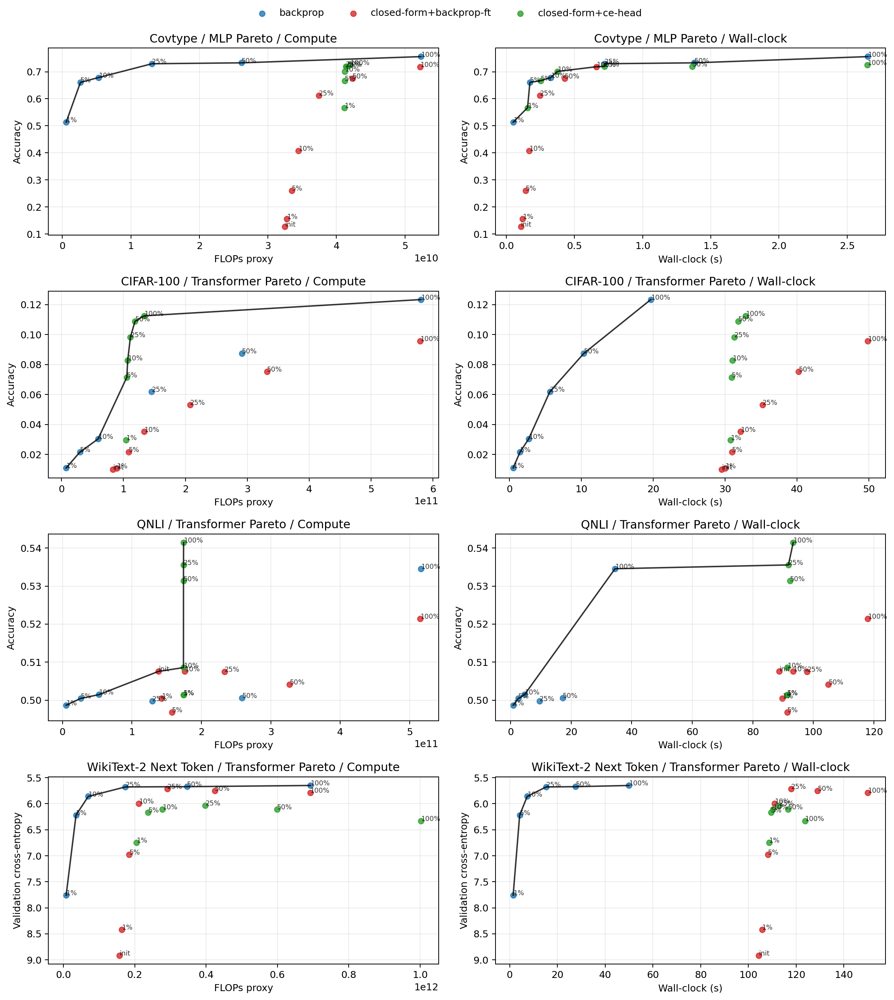
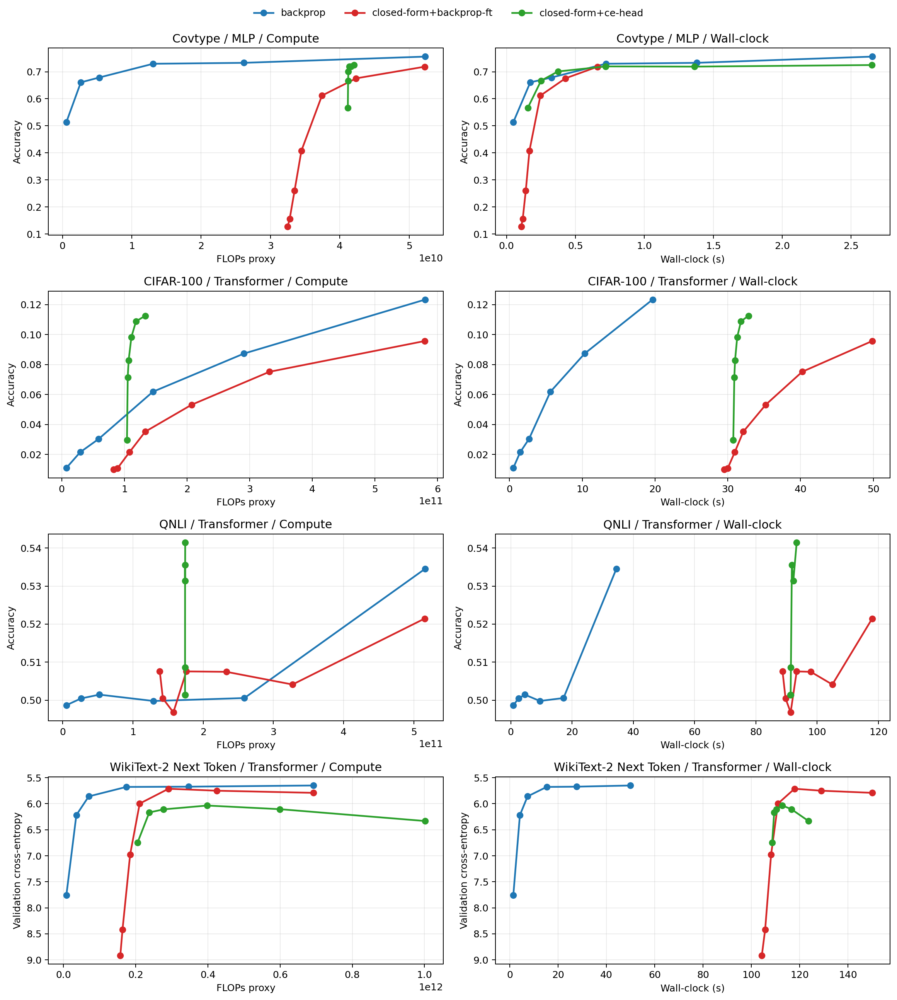

# vicreg_superlinear

## Introduction

This repository studies **closed-form neural initialization**, with the main emphasis on transformers. Here, “closed-form” means that the encoder is built analytically from paired training views using covariance/eigendecomposition and ridge-style solves, instead of being obtained by end-to-end gradient descent. For transformers, this yields a spectral self-attention block plus analytically fitted feed-forward maps; an MLP variant is included as a secondary baseline. The key question is whether this analytic encoder is useful as an initialization for supervised learning.

The benchmark compares three model classes: ordinary backprop from scratch, `closed-form init + compute-matched fine-tune`, and `closed-form init + CE head only`. Evaluation covers four scenarios spanning tabular, vision, and NLP workloads: `covtype / MLP`, `cifar100 / transformer`, `qnli / transformer`, and `wikitext2 next-token / transformer`, with the transformer results being the main focus. For each scenario, we measure matched-budget final performance, anytime behavior against FLOPs proxy and wall-clock, compute-to-target, low-data behavior, OOD robustness, seed sensitivity, transfer/amortization, and Pareto frontiers over compute and time.

The main result is negative for the intended method: `closed-form init + compute-matched fine-tune` does not beat backprop at full budget on any of the four main scenarios. The strongest positive signal is narrower: `closed-form init + CE head only` is competitive on `qnli` and in some low-data regimes, and can look attractive on the compute frontier, but these gains do not currently translate into better wall-clock. The main practical bottleneck remains systems efficiency, especially for transformers.

## Benchmark setup

The main benchmark runner is [init_finetune_realworld_eval.py](/c:/Users/DavWi/Main/Projekte/vicreg_superlinear/init_finetune_realworld_eval.py). It compares:

- `backprop`: ordinary training from scratch
- `closed-form init + compute-matched fine-tune`: build the encoder analytically from paired views, then fine-tune with the same total compute budget as backprop
- `closed-form init + CE head only`: build the encoder analytically, freeze it, and train only a cross-entropy readout

Benchmark scope:

- Scenarios: `covtype / MLP`, `cifar100 / transformer`, `qnli / transformer`, `wikitext2 next-token / transformer`
- Regimes: full-budget comparison, low-data slices, and shared-init transfer/amortization
- Analytics: anytime curves vs FLOPs proxy and wall-clock, compute-to-target, OOD robustness, seed sensitivity, and Pareto frontiers
- Seeds: `7`, `11`, `19`

## Results

### Main outcome

At the same total budget, `closed-form init + compute-matched fine-tune` did **not** beat pure backprop on any of the 4 full-data matched-budget scenarios.

Matched-budget finals:

| Scenario | Metric | Backprop | CF init + FT | CF init + CE head |
| --- | --- | ---: | ---: | ---: |
| `covtype / mlp` | Accuracy | `0.7561` | `0.7187` | `0.7249` |
| `cifar100 / transformer` | Accuracy | `0.1233` | `0.0957` | `0.1125` |
| `qnli / transformer` | Accuracy | `0.5346` | `0.5214` | `0.5414` |
| `wikitext2 next-token / transformer` | Validation CE | `5.6511` | `5.7923` | `6.3336` |

Interpretation:

- The compute-matched fine-tune variant is not a full-budget win.
- The strongest positive result is narrower: `closed-form init + CE head` is competitive on `qnli`, and low-data transformer runs show some promise.

### Low-data behavior

The initialization story is better in low-data settings:

- `qnli` at `10%` data: fine-tune `0.5129` vs backprop `0.5012`
- `wikitext2` at `10%` data: fine-tune CE `6.1502` vs backprop CE `6.3247`
- `cifar100` at `1%-10%` data: CE-head is often the strongest compute-efficient control

### Compute-to-target

The benchmark also asked whether the method reaches a useful target with less total compute or less wall-clock.

The result is mixed:

- `qnli`: `closed-form+ce-head` and `closed-form+backprop-ft` reach the target with much lower FLOPs proxy than backprop, but both are still much slower in wall-clock.
- `cifar100`: `closed-form+ce-head` reaches the target with lower FLOPs proxy than backprop, but again loses on wall-clock.
- `wikitext2`: backprop dominates; CE-head never reaches the target and fine-tune reaches it much later.
- `covtype`: backprop remains the strongest practical baseline.

### OOD

OOD results are logged for all final models.

Main patterns:

- `qnli`: all models are stable under heavy masking and truncation; CE-head is slightly best overall.
- `wikitext2`: fine-tune degrades less than backprop under truncation, but starts from a worse in-distribution CE.
- `covtype`: fine-tune drops less under feature masking, but CE-head is brittle under Gaussian noise.
- `cifar100`: backprop remains best in absolute OOD accuracy.

### Transfer / amortization

Shared initialization did not rescue the compute-matched fine-tune variant. Across the tested transfer setup:

- `closed-form+backprop-ft` underperformed scratch backprop on all 4 scenarios
- `closed-form+ce-head` had some attractive compute-only points on `cifar100` and `qnli`
- none of the shared-init variants delivered a clean wall-clock win

## Plots and artifacts

Plots are in `results/plots/init_finetune_realworld_eval/`, and the structured analytics are in `results/json/` with the `init_finetune_realworld_eval*` prefix.

## Conclusion

Using the original worth-it criteria:

1. **Same total budget, better quality?**
   No. The compute-matched fine-tune variant lost to backprop on all 4 full-data matched-budget finals.

2. **Same target quality, less total compute or less wall-clock?**
   Not as a practical method. There are some compute-only wins, mostly for `closed-form+ce-head`, but not corresponding wall-clock wins.

3. **Stable across tasks, seeds, and shifts?**
   Not enough. Some low-data and text-shift results are promising, but the advantage is not broad or robust enough.

Final takeaway:

- `closed-form init + compute-matched fine-tune` is **not yet worth adopting as the main real-world method**.
- `closed-form init + CE head` is the most interesting follow-up direction for classification and low-data settings.
- The remaining blocker to a real-world win is **wall-clock efficiency**, especially for transformers.
